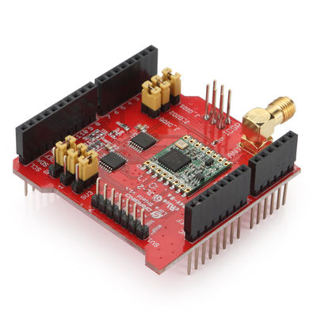
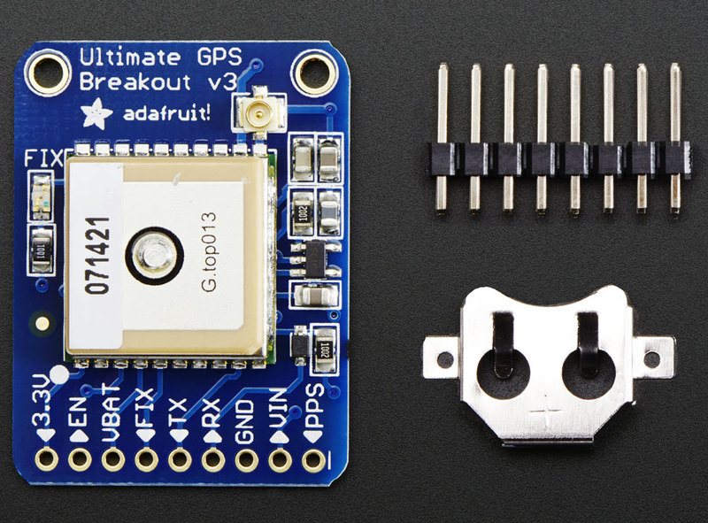

# gpsLoRaSurveyor

This arduino project is designed to help determine the range of LoRa gateways,
specifically it is being used to see the range of a Multitech Conduit paired with a Dragino LoRa shield.  
 <a href="http://wiki.dragino.com/index.php?title=Lora_Shield">Information about the Dragino LoRa shield</a>
 
 <a href="https://learn.adafruit.com/adafruit-ultimate-gps/overview">Guide for using the Adafruit GPS module</a>
 
<a href="https://www.adafruit.com/product/746">Adafruit GPS module product page</a>
